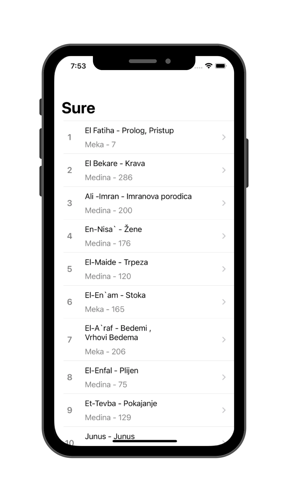
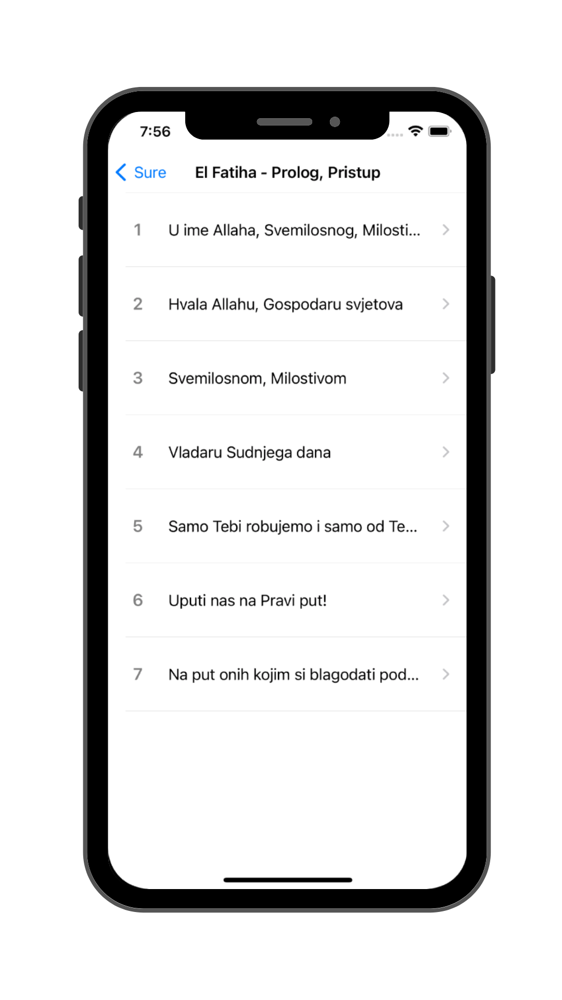
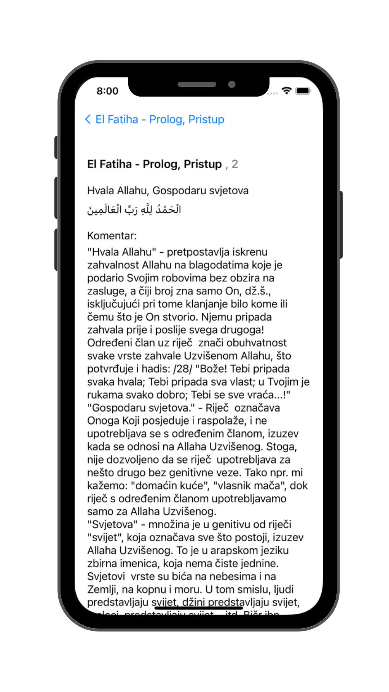

  
  
  

  
  

# Tefsir Ibn Kesir

## Overview
Tefsir Ibn Kesir iOS app is a simple and user-friendly application designed to provide a digital version of the commentary on the Quran in Bosnian. It is actually an unofficial app for the website tefsir.ba. The app allows users to easily navigate through chapters, select specific verses, and read the corresponding commentary. With the added functionality of swipe gestures, users can conveniently navigate between verses for a seamless reading experience.

